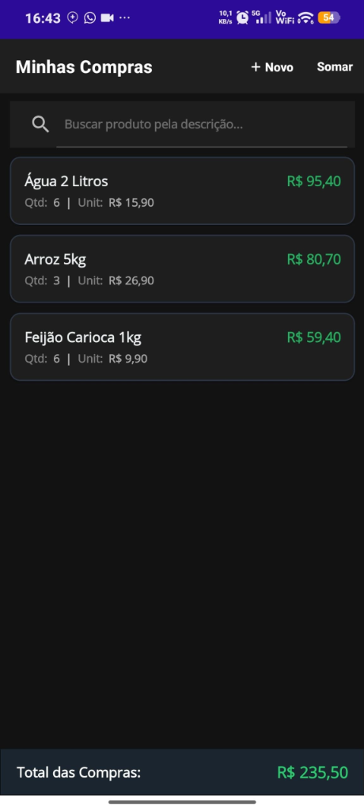
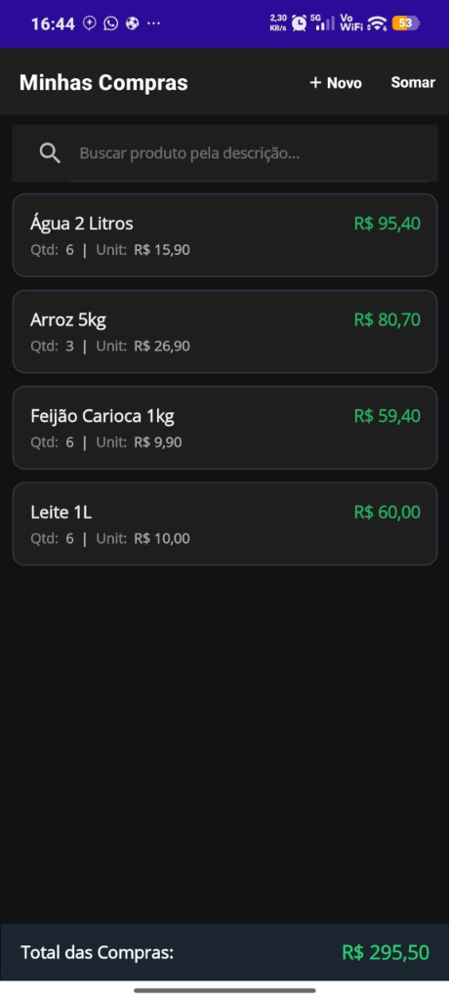
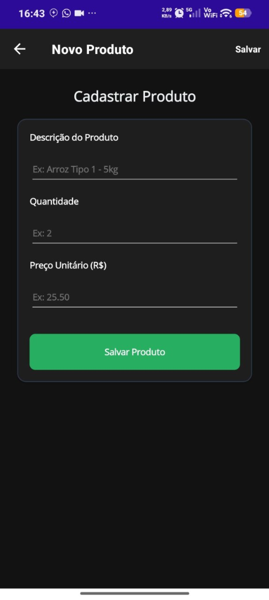
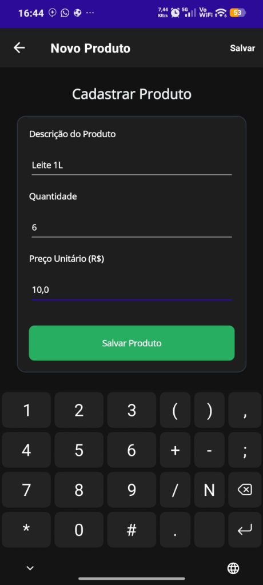
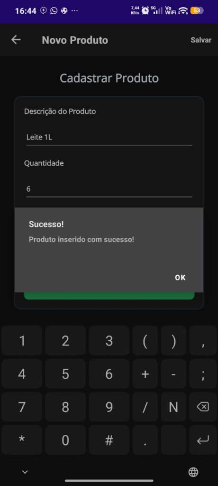
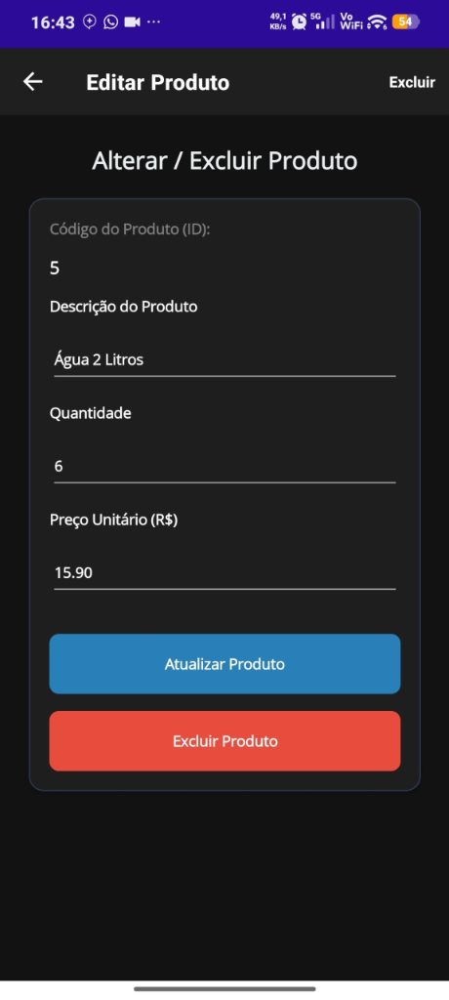
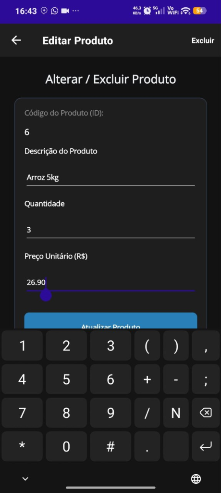

# 📱 MauiAppMinhasCompras - Agenda 02 (Desenvolvimento de Sistemas III)

Aplicativo multiplataforma desenvolvido em **.NET MAUI 9** com persistência local de dados em banco de dados **SQLite** assíncrono. O aplicativo gerencia uma lista de compras com controle de quantidade, preço unitário, cálculo automático de subtotais e somatória geral acumulada, além de operações CRUD completas (Criar, Listar, Atualizar e Excluir) e busca em tempo real.

---

## 📸 Demonstração do App em Execução no Celular

Abaixo estão as capturas de tela reais do aplicativo em execução em dispositivo móvel Android:

### 🛒 Listagem de Compras e Totalizador
| Lista com 3 Itens (Total R$ 235,50) | Lista com 4 Itens (Total R$ 295,50) |
| :---: | :---: |
|  |  |

### 📝 Fluxo de Cadastro de Novo Produto
| Formulário Limpo | Preenchimento com Teclado | Confirmação de Sucesso (Alerta) |
| :---: | :---: | :---: |
|  |  |  |

### ✏️ Fluxo de Edição e Exclusão
| Tela de Edição / Exclusão | Ajuste de Valores com Teclado Numérico |
| :---: | :---: |
|  |  |

---

## 🎯 Funcionalidades Implementadas

- [x] **Inserção de Produtos (`Insert`):** Cadastro de itens com descrição, quantidade e preço unitário com validações e feedback por alerta modal.
- [x] **Listagem Completa (`GetAll`):** Exibição dinâmica em cartões com nome, quantidade, preço unitário e subtotal formatado em moeda (`R$`).
- [x] **Totalizador Automático:** Barra inferior fixa com a somatória em tempo real de todas as compras cadastradas e botão **Somar** na barra superior.
- [x] **Busca em Tempo Real (`Search`):** Barra de pesquisa com filtro instantâneo por descrição via operador `LIKE`.
- [x] **Edição de Produtos (`Update`):** Alteração de qualquer campo com persistência imediata no SQLite via query parametrizada.
- [x] **Exclusão de Produtos (`Delete`):** Remoção de itens com diálogo de confirmação (`DisplayAlert`).
- [x] **Validação Segura de Entradas:** Tratamento de campos em branco e suporte a números com vírgula ou ponto decimal (`double.TryParse`).
- [x] **Interface Moderna e Responsiva:** Suporte a Tema Claro e Escuro (Dark Mode nativo).

---

## 🛠️ Arquitetura e Estrutura do Código

```
📁 Fichário_Agenda 02_Desenvolvimento_de_Sistemas_03
├── 📁 Models/
│   └── Produto.cs                  # Entidade Produto (Mapeamento ORM SQLite)
├── 📁 Helpers/
│   └── SQLiteDatabaseHelper.cs     # Camada de Acesso a Dados (CRUD Assíncrono)
├── 📁 Views/
│   ├── ListaProduto.xaml (.cs)     # Tela Principal (Listagem, Busca e Total)
│   ├── NovoProduto.xaml (.cs)      # Tela de Cadastro (Formulário e Validação)
│   └── EditarProduto.xaml (.cs)    # Tela de Edição e Exclusão
├── 📁 docs/
│   └── 📁 screenshots/             # Evidências visuais do app em execução
├── 📁 APK_Instalador/
│   └── MinhasCompras_Android.apk   # Pacote compilado para instalação direta
├── App.xaml (.cs)                  # Inicialização e Padrão Singleton (App.Db)
├── MauiProgram.cs                  # Bootstrapper e configuração de fontes/logs
├── MauiAppMinhasCompras.csproj     # Dependências (sqlite-net-pcl) e targets
└── .gitignore                      # Proteção contra pastas temporárias (bin/obj)
```

---

## 🔍 Detalhamento dos Componentes

### 1. Modelo de Dados (`Models/Produto.cs`)
Utiliza anotações do pacote `sqlite-net-pcl` para mapear a classe diretamente para uma tabela no banco SQLite:
- `[PrimaryKey, AutoIncrement] public int Id`: Chave primária gerada sequencialmente pelo banco.
- `public string Descricao`: Nome do item comprado.
- `public double Quantidade`: Quantidade de itens (suporta números fracionados como kg ou litros).
- `public double Preco`: Valor unitário do produto.
- `public double Total => Quantidade * Preco`: Propriedade calculada em tempo de execução sem redundância no banco.

### 2. Camada de Dados (`Helpers/SQLiteDatabaseHelper.cs`)
Implementa a comunicação com o banco de dados através da conexão `SQLiteAsyncConnection`, garantindo que nenhuma operação bloqueie a interface gráfica (UI Thread):
- **Criação da Tabela:** `_conn.CreateTableAsync<Produto>()` executado na inicialização.
- **Inserir:** `Insert(Produto p)` com retorno assíncrono da quantidade de linhas inseridas.
- **Atualizar (Correção do Bug 1 do material):** Utiliza `_conn.ExecuteAsync` retornando `Task<int>`.
- **Excluir:** `Delete(int id)` usando expressão lambda `i => i.Id == id`.
- **Listar Todos:** `GetAll()` retornando `Task<List<Produto>>`.
- **Buscar (Correção do Bug 2 do material):** `Search(string q)` com a query SQL correta `SELECT * FROM Produto WHERE Descricao LIKE ?` com parâmetros seguros contra injeção de SQL.

### 3. Padrão Singleton Global (`App.xaml.cs`)
Centraliza o acesso ao banco em uma única instância estática acessível por qualquer tela do aplicativo:
```csharp
public static SQLiteDatabaseHelper Db {
    get {
        if (_db == null) {
            string pasta = Environment.GetFolderPath(Environment.SpecialFolder.LocalApplicationData);
            string path = Path.Combine(pasta, "banco_sqlite_compras.db3");
            _db = new SQLiteDatabaseHelper(path);
        }
        return _db;
    }
}
```

---

## 🚀 Como Executar o Projeto

### Opção 1: Pelo Visual Studio 2022
1. Abra o arquivo de solução `MauiAppMinhasCompras.sln`.
2. Certifique-se de que a carga de trabalho **Desenvolvimento do .NET MAUI** está instalada.
3. Selecione o dispositivo de destino: **Emulador Android**, **Windows Machine** ou **Celular Físico** (via Depuração USB).
4. Pressione `F5` para compilar e executar.

### Opção 2: Linha de Comando (.NET CLI)
```bash
# Compilar para Windows
dotnet build -f net9.0-windows10.0.19041.0

# Compilar para Android
dotnet build -f net9.0-android
```

### Opção 3: Instalação Direta no Celular (Arquivo APK)
O pacote compilado e pronto para uso está localizado em:
👉 **`APK_Instalador/MinhasCompras_Android.apk`**

Basta transferir para o smartphone Android e tocar para instalar.

---

## 📦 Envio para o GitHub

Para subir o projeto para o seu repositório pessoal no GitHub:

```bash
# 1. Adicionar o link do seu repositório remoto no GitHub
git remote add origin https://github.com/SEU-USUARIO/SEU-REPOSITORIO.git

# 2. Enviar os arquivos para a branch principal
git branch -M main
git push -u origin main
```
