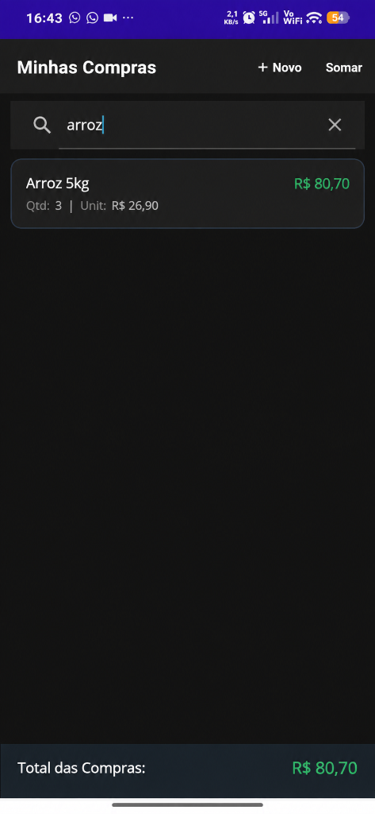

# 📱 MauiAppMinhasCompras - Agenda 04 (.NET MAUI + SQLite)

Aplicativo multiplataforma desenvolvido em **.NET MAUI 9** com persistência local de dados em banco de dados **SQLite** assíncrono e coleções reativas **`ObservableCollection<Produto>`**. O aplicativo gerencia uma lista de compras com controle de quantidade, preço unitário, cálculo automático de subtotais e somatória geral acumulada, além de operações CRUD completas e mecanismo de busca instantânea via **`SearchBar`** (evento `TextChanged`).

---

## 📸 Demonstração do App em Execução no Celular (Fluxo Completo)

Abaixo estão as capturas de tela reais do aplicativo em execução em dispositivo móvel Android, organizadas na sequência lógica de operação:

### 1️⃣ Listagem Inicial e Busca em Tempo Real (`SearchBar` com "arroz")
| Lista Inicial (3 Itens - R$ 235,50) | 🔍 Busca em Tempo Real (Filtrando "arroz" - R$ 80,70) |
| :---: | :---: |
|  |  |

### 2️⃣ Fluxo de Cadastro de Novo Produto
| Formulário Limpo | Preenchimento com Teclado | Confirmação de Sucesso (Alerta) |
| :---: | :---: | :---: |
|  |  |  |

### 3️⃣ Fluxo de Edição, Exclusão e Lista Atualizada
| Tela de Edição / Exclusão | Ajuste com Teclado | Lista com 4 Itens (R$ 295,50) |
| :---: | :---: | :---: |
|  |  |  |

---

## 🎓 Principais Aprendizados e Conceitos Aplicados

Durante o desenvolvimento deste projeto da **Agenda 04**, foram consolidados os seguintes conceitos de engenharia de software mobile:

### 1. Manipulação Reativa de Interface com `ObservableCollection<T>`
- Vinculação da interface com a classe `ObservableCollection<Produto>`, herdada de `Collection<T>` e implementando a interface `INotifyCollectionChanged`.
- Notificação e re-renderização automática dos elementos da UI a cada adição (`Add`), remoção (`Remove`) ou limpeza (`Clear`), sem necessidade de reatribuir manualmente o `ItemsSource`.

### 2. Busca Instantânea em Tempo Real (`SearchBar` + `TextChanged`)
- Captura contínua de caracteres através do evento `TextChanged` da `SearchBar`.
- Filtragem instantânea da coleção em memória RAM utilizando LINQ (`Contains` com `StringComparison.OrdinalIgnoreCase`), mantendo taxa estável de 60 FPS e eliminando concorrência de I/O no banco SQLite.
- Recálculo dinâmico da somatória geral (`Total das Compras`) em tempo real no rodapé.

### 3. Banco de Dados Local com SQLite e ORM (`sqlite-net-pcl`)
- Mapeamento Objeto-Relacional (**ORM**), convertendo a classe `Produto` em uma tabela de banco relacional local usando as diretivas `[PrimaryKey, AutoIncrement]`.
- Armazenamento em diretório seguro e isolado da aplicação através de `Environment.SpecialFolder.LocalApplicationData`.

### 4. Padrão Singleton Global (`App.Db`)
- Gerenciamento de uma única instância estática da conexão com o banco SQLite em `App.Db`, prevenindo concorrência e vazamento de memória.

### 5. Boas Práticas de Segurança e Validação de Dados
- **Prevenção contra SQL Injection:** Uso de queries parametrizadas com placeholders (`?`) em instruções `UPDATE` e `SELECT LIKE`.
- **Tratamento de Tipos:** Validação de entradas numéricas com `double.TryParse` aceitando vírgula ou ponto decimal.
- **Diálogos de Confirmação:** Uso de `DisplayAlert` modal para confirmar operações críticas.

---

## 🛠️ Estrutura do Código

```
📁 Fichário_Agenda 02_Desenvolvimento_de_Sistemas_03
├── 📁 Models/
│   └── Produto.cs                  # Entidade Produto (Mapeamento ORM SQLite)
├── 📁 Helpers/
│   └── SQLiteDatabaseHelper.cs     # Camada de Acesso a Dados (CRUD Assíncrono)
├── 📁 Views/
│   ├── ListaProduto.xaml (.cs)     # Tela Principal (ObservableCollection, Busca e Total)
│   ├── NovoProduto.xaml (.cs)      # Tela de Cadastro (Formulário e Validação)
│   └── EditarProduto.xaml (.cs)    # Tela de Edição e Exclusão
├── 📁 docs/
│   ├── 📁 screenshots/             # Evidências organizadas na sequência do app
│   └── 📁 evidencias_alta_resolucao/ # Prints originais em Full HD 1080p
├── 📁 APK_Instalador/
│   └── MinhasCompras_Android.apk   # Pacote compilado para instalação direta
├── Fichario_Agenda04_DS3_ValdanConceicao.pdf # Relatório Oficial da Agenda 04 em PDF
├── App.xaml (.cs)                  # Inicialização e Padrão Singleton (App.Db)
├── MauiProgram.cs                  # Bootstrapper e configuração de fontes/logs
├── MauiAppMinhasCompras.csproj     # Dependências (sqlite-net-pcl) e targets
└── .gitignore                      # Proteção contra pastas temporárias (bin/obj)
```

---

## 🚀 Como Executar o Projeto

### Opção 1: Linha de Comando (.NET CLI)
```bash
# Compilar para Windows
dotnet build -f net9.0-windows10.0.19041.0

# Compilar para Android
dotnet build -f net9.0-android
```

### Opção 2: Pelo Visual Studio 2022
1. Abra a solução `MauiAppMinhasCompras.sln`.
2. Selecione o dispositivo (Emulador Android ou Windows Machine).
3. Pressione `F5` para executar.

---

## 📦 Repositório GitHub

- **URL:** [https://github.com/valdandaconceicao-boop/Fich-rio_Agenda-02_Desenvolvimento_de_Sistemas_03](https://github.com/valdandaconceicao-boop/Fich-rio_Agenda-02_Desenvolvimento_de_Sistemas_03)
- **Branch:** `main`